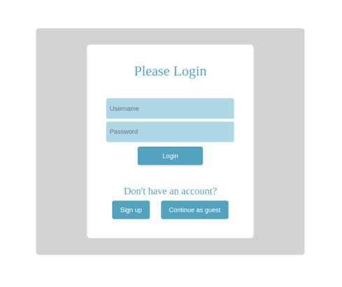
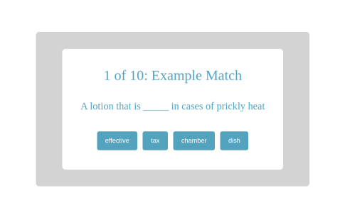
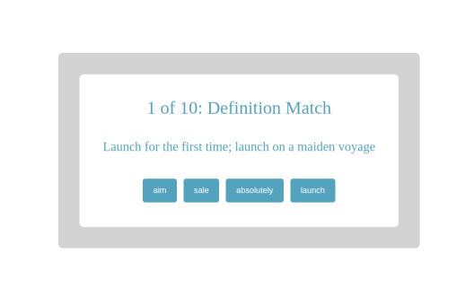
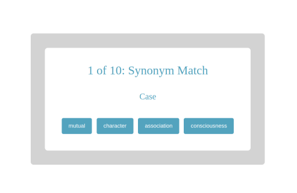
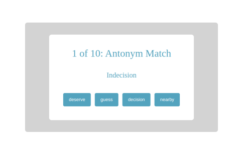
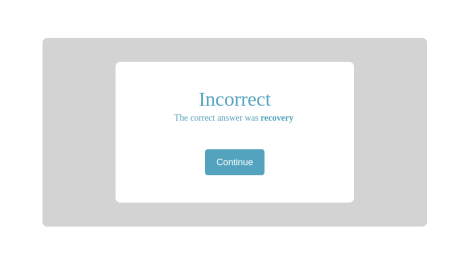
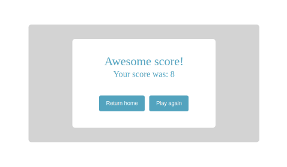
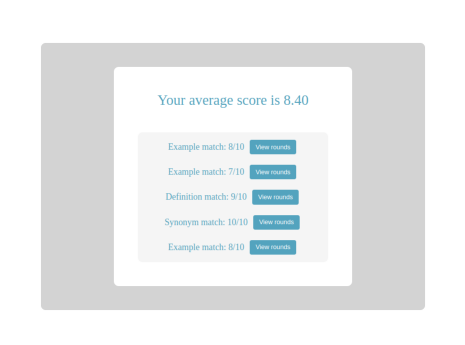
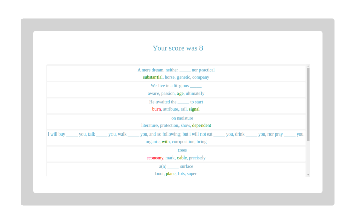

# Find the Word

All code in this repository is under a MIT license which can be viewed in License.txt

Find the Word is a website that is used to test word knowledge through multiple different types of games.

Due to the end of service from ElephantSQL, Find the Word is no longer live.

The questions are sourced from [WordsAPI](https://rapidapi.com/dpventures/api/wordsapi/)

To play you first need to login or signup, but you can also continue as a guest to bypass that step.

Once you've logged in you will be presented with the 4 different types of tests:
- Example match:
  * You are given a sentence with one blank and must choose the correct answer from 4 options. 
  

- Definition match: 
  * You are given the definition of word and must choose which word out of 4 options it defines.
  

- Synonym match:
  * You are given a word or phrase and must choose which word out 4 options is its synonym.

- Antonym match:
  * You are given a word or phrase and must choose which word out 4 option is its antonym.

After each round you are given the results of the round, and if it was incorrect the correct answer is shown.

After you've completed all the rounds it will show your results.

To view previous games you can click on the statistics tab, and it will show all the games you've played.

From there you can choose a specific game and view each round.

